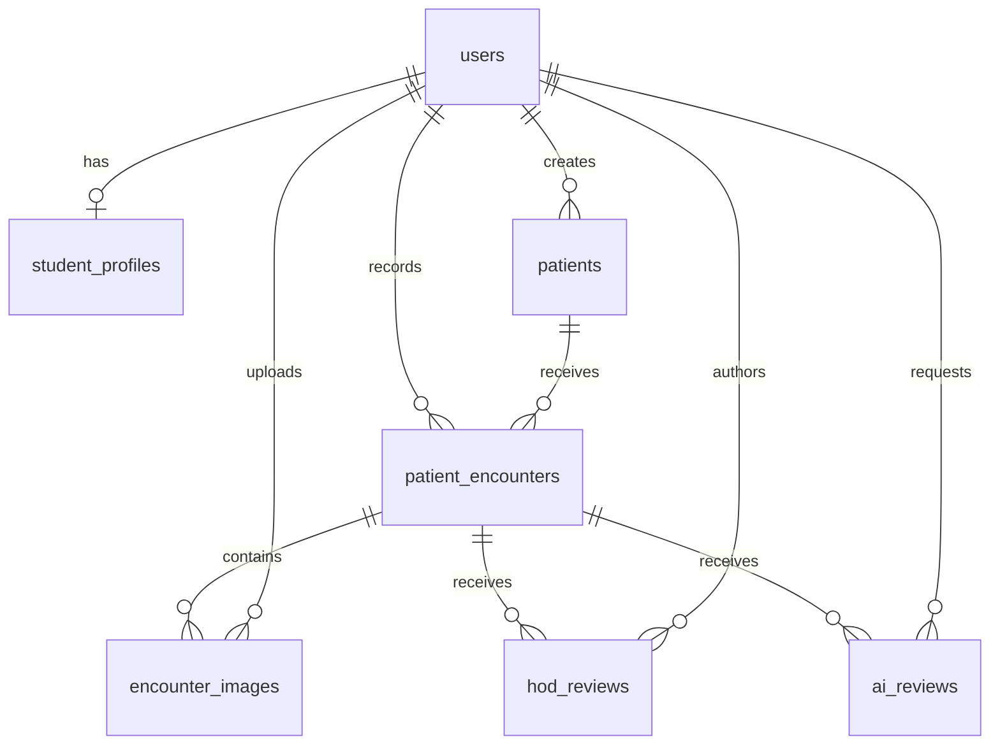

# ClinObserve — Database Design

Status: implemented version 1 schema on PHP 8.3.33. Migrations and workflows have been exercised on SQLite and MySQL 8.4.3. See PROJECT_PLAN.md for permissions and README.md for installation.

## 1. Conventions and invariants

- InnoDB/utf8mb4 on the chosen MySQL/MariaDB host. IDs are unsigned BIGINT primary keys unless stated otherwise. Every domain table has created_at and updated_at timestamps. All columns are NOT NULL unless marked `?` (nullable).
- Store instants in UTC; convert calendar day/month boundaries from a single configured institution timezone (initial proposal Asia/Kolkata) into half-open UTC ranges. Admission and birth dates are DATE values without timezone conversion.
- Status/gender/role values use bounded VARCHAR columns and application backed enums/validation, avoiding vendor-specific enums. Add supported CHECK constraints where appropriate, while keeping application validation authoritative for user input.
- All foreign keys restrict deletion unless explicitly stated. Deactivate accounts; do not silently delete academic history. No routine hard-delete or soft-delete workflow for users, cases, encounters or reviews in version 1. Image removal is allowed before encounter locking and requires private file cleanup.
- All foreign keys receive a supporting index (or a composite index beginning with that key). Avoid redundant indexes. Explicitly name long composite indexes within engine limits.
- Single department per deployment. Do not interpret these permissions as cross-institution isolation.
- `patient_encounters` is an entity with its own ID. Never create a unique constraint on `(patient_id, student_id)` or `(patient_id, student_id, attended_at)`; repeat observations are valid.

## 2. Relationship diagram

## 3. users

Common authentication information for both roles. Extend the existing users migration through a new migration; preserve existing records.

| Column | Type / default | Meaning |
| --- | --- | --- |
| id | BIGINT PK | Account identifier |
| name | VARCHAR(255) | Student/HOD name |
| email | VARCHAR(255), UNIQUE | Normalize to lowercase; login identifier |
| email_verified_at | TIMESTAMP ? | Existing Laravel field |
| password | VARCHAR(255) | Laravel password hash only |
| role | VARCHAR(16), default student | `hod` or `student`; never student-editable |
| is_active | BOOLEAN, default false | Provisioning service explicitly activates valid accounts |
| must_change_password | BOOLEAN, default true | Temporary credential flow |
| remember_token | VARCHAR(100) ? | Existing Laravel remember token |
| last_login_at | TIMESTAMP ? | Successful login only |
| created_by | BIGINT ? FK users.id | HOD provisioner; null for initial HOD/bootstrap |
| created_at, updated_at | TIMESTAMP | Audit times |

Indexes: UNIQUE(email), (role, is_active), FK index(created_by). Existing starter accounts receive the restrictive defaults; never infer HOD access from an existing email. Password reset/deactivation removes database sessions and rotates remember_token. Existing HOD role is not editable through student-management endpoints.

Relationships: studentProfile hasOne; encounters hasMany through student_id; createdPatients hasMany through created_by; uploadedImages, hodReviews and requestedAiReviews have explicit actor foreign keys.

## 4. student_profiles

| Column | Type | Meaning |
| --- | --- | --- |
| id | BIGINT PK | Profile identifier |
| user_id | BIGINT UNIQUE FK users.id | Exactly one profile per student |
| roll_number | VARCHAR(50) UNIQUE | Department-wide academic identifier |
| registration_number | VARCHAR(100) ? UNIQUE | Optional institutional identifier; empty becomes null |
| batch | VARCHAR(50) | Batch/group |
| academic_year | VARCHAR(20) | Academic period, e.g. 2026–2027 |
| college, course, department | VARCHAR(150) ? each | Academic biodata |
| joining_year | SMALLINT UNSIGNED ? | Four-digit year validated in reasonable range |
| phone | VARCHAR(30) ? | Own-editable contact field |
| date_of_birth | DATE ? | Own-editable; past date |
| gender | VARCHAR(30) ? | Validated values including undisclosed |
| address, bio | TEXT ? each | Own-editable personal information |
| avatar_path | VARCHAR(255) ? | Random path on configured private disk |
| created_at, updated_at | TIMESTAMP | Audit times |

Indexes: unique keys above; (academic_year, batch). User and profile are created atomically. Application invariant: user_id references a student-role account; ordinary FK cannot enforce a role predicate. Profile routes/policies enforce this invariant and prevent ownership reassignment. Student name/email are not duplicated here.

## 5. patients

Shared synthetic/de-identified case context. No legal patient name, phone, address, hospital identifier or patient date of birth.

| Column | Type / default | Meaning |
| --- | --- | --- |
| id | BIGINT PK | Case identity |
| case_number | VARCHAR(40) UNIQUE | Server-generated `CASE-` plus ULID; no MAX(id)+1 generation |
| display_name | VARCHAR(120) | Synthetic label / de-identified alias |
| data_classification | VARCHAR(20), default synthetic | `synthetic` or `deidentified`; explicitly confirmed on form |
| gender | VARCHAR(30) | Female/male/other/unknown/undisclosed |
| age_years | SMALLINT UNSIGNED | Age at admission, validated 0–130; not a changing calculated age |
| admission_date | DATE | Admission date; validated nonfuture for version 1 |
| chief_complaint | TEXT ? | Initial context |
| presenting_symptoms | TEXT ? | Initial symptom context |
| history_of_present_illness | TEXT ? | Case history |
| past_medical_history, family_history | TEXT ? each | Optional context |
| medication_history, allergy_history, social_history | TEXT ? each | Optional context |
| examination_findings | TEXT ? | Shared initial examination context |
| working_diagnosis, confirmed_diagnosis | TEXT ? each | Recorded case context only, no system-generated diagnosis |
| investigations, management_notes, clinical_notes | TEXT ? each | Academic case context |
| condition | VARCHAR(150) ? | Human-entered condition/topic label for filtering |
| additional_context | JSON ? | Allow-listed versioned extension keys only; promote frequently queried fields to columns |
| created_by | BIGINT FK users.id | Authenticated creator |
| updated_by | BIGINT FK users.id | Last authorized editor |
| created_at, updated_at | TIMESTAMP | Audit times |

Indexes: UNIQUE(case_number), (admission_date, id), (condition, admission_date), FK indexes(created_by, updated_by separately). Search case number by exact/prefix match; small-demo display-name substring search may scan. Add full-text search only after measured need. Gender filter does not initially justify a low-selectivity standalone index.

ULID generation plus a database unique constraint is safe under concurrent creation; retry the extremely unlikely duplicate. Creator may edit only before any encounter exists, checked within a transaction that locks the patient row. Encounter creation uses the same patient lock to prevent edit/create races. HOD may correct shared context; prior AI input snapshots remain unchanged.

## 6. patient_encounters

| Column | Type / default | Meaning |
| --- | --- | --- |
| id | BIGINT PK | One attendance/observation |
| patient_id | BIGINT FK patients.id | Observed case |
| student_id | BIGINT FK users.id | Authoring student; assigned from authenticated account |
| attended_at | DATETIME | UTC observation instant, indexed |
| summary | TEXT | Required academic summary |
| symptoms_observed | TEXT ? | Student's observation |
| examination_findings | TEXT ? | Student's examination documentation |
| assessment | TEXT ? | Student's academic assessment |
| learning_notes | TEXT ? | Shared academic learning notes; no private faculty data |
| locked_at | TIMESTAMP ? | First AI attempt or faculty review locks observation and images |
| created_at, updated_at | TIMESTAMP | Authoring and editing timestamps |

Indexes: (student_id, attended_at, id), (patient_id, attended_at, id), (attended_at, id). The first two also support their FKs.

Validate attended_at not in future and not before case admission in institution time. student_id must be an active student. patient_id/student_id cannot be reassigned on edit. Serialize edits, image mutations, review creation and first lock with the encounter row lock. A failed AI attempt still leaves the observation locked; this preserves the reviewed input, and the UI explains this before requesting review. Later attendance becomes another encounter.

Relationships: patient belongsTo Patient; student belongsTo User; images, hodReviews and aiReviews hasMany. A derived distinct patient list comes through encounters; do not maintain a separate patient_student pivot or stored encounter counters.

## 7. encounter_images

| Column | Type | Meaning |
| --- | --- | --- |
| id | BIGINT PK | Protected image identifier |
| encounter_id | BIGINT FK patient_encounters.id | Parent observation |
| file_path | VARCHAR(255) UNIQUE | Random private disk path, not an HTTP URL |
| original_name | VARCHAR(255) ? | Sanitized basename for private metadata only; never used as a path |
| mime_type | VARCHAR(100) | Detected/re-encoded JPEG, PNG or WebP |
| file_size | BIGINT UNSIGNED | Stored byte size after re-encoding |
| uploaded_by | BIGINT FK users.id | Server-assigned actor |
| created_at, updated_at | TIMESTAMP | Upload metadata audit |

Indexes: UNIQUE(file_path), (encounter_id, created_at), FK index(uploaded_by). The disk is fixed by configuration, not user input. The viewing endpoint derives its path from this authorized record and sends safe Content-Type, nosniff, private/no-store cache headers and a generic filename.

File writes and database transactions cannot be atomic together: track newly written paths and remove them on rollback. When deleting an unlocked image, arrange cleanup with recoverable error handling; reconcile orphan files through an explicit maintenance command. Enforce the five-image total under an encounter row lock, not only the per-request count. Avatars use the same validation/storage discipline but a separate authorization rule and 2 MiB limit.

## 8. hod_reviews

| Column | Type | Meaning |
| --- | --- | --- |
| id | BIGINT PK | Faculty comment |
| encounter_id | BIGINT FK patient_encounters.id | Reviewed observation |
| hod_id | BIGINT FK users.id | Authenticated HOD author |
| comment | TEXT | Required plain text feedback; bounded by validation |
| created_at, updated_at | TIMESTAMP | Added/last edited times |

Indexes: (encounter_id, created_at, id), (hod_id, created_at). Multiple comments per encounter and HOD are allowed. HOD role is verified server-side. Private access is based on encounter.student_id or HOD role; it does not follow shared case visibility. Only the authoring HOD can change a comment. Version 1 preserves creation/edit timestamps but does not retain previous comment text; append a new comment when a full historical correction is desired.

Waiting for faculty feedback means an encounter has no hod_reviews. Compute using relationship existence; do not store a second review-status value that can drift.

## 9. ai_reviews

| Column | Type / default | Meaning |
| --- | --- | --- |
| id | BIGINT PK | One request attempt / historical review |
| encounter_id | BIGINT FK patient_encounters.id | Source observation |
| requested_by | BIGINT FK users.id | Student who explicitly requested it |
| request_key | CHAR(36) UNIQUE | Per-form UUID for duplicate submission detection |
| provider | VARCHAR(40) | Configured adapter name |
| model | VARCHAR(150) | Actual configured model identifier at request time |
| prompt_version | VARCHAR(40) | Immutable server prompt version identifier |
| status | VARCHAR(20), default pending | pending / succeeded / failed |
| input_snapshot | JSON | Minimized text context actually sent; no identifiers/images |
| input_hash | CHAR(64) | SHA-256 of canonical minimized payload |
| structured_response | JSON ? | Only validated result schema; absent on failure |
| error_code | VARCHAR(60) ? | Safe internal category; no raw provider error body |
| privacy_confirmed_at | TIMESTAMP | Time student confirmed minimized preview |
| completed_at | TIMESTAMP ? | Success/failure completion |
| created_at, updated_at | TIMESTAMP | Attempt start and status transition |

Indexes: UNIQUE(request_key), (encounter_id, created_at, id), (requested_by, created_at, id), (status, created_at). No uniqueness on encounter_id or input_hash: intentional repeat reviews are historical versions. No duplicate student_id column: owner is encounter.student_id; requested_by records the actor and must equal that owner in version 1.

Store neither raw HTTP response nor API keys. structured_response alone is the canonical result. State transition may update a pending row once; finalized rows are immutable. New review attempts insert new rows. Validate JSON shape/size before persistence and render escaped strings. input_snapshot is private and follows the same owner/HOD policy as results.

On submission, lock encounter, detect/reconcile expired pending attempts, enforce one live pending attempt, and insert; commit before network I/O. Set request expiry longer than HTTP timeout (proposal 60 seconds). Late responses may finalize only rows still pending, preventing revival of expired attempts. Reusing a request_key returns an existing review only after verifying its ownership and encounter match. Apply per-user rate/cost limits independently.

## 10. Laravel infrastructure tables

Preserve the existing scaffold migrations/tables; additional domain migrations build on them.

| Table | Existing columns / keys | Intended use |
| --- | --- | --- |
| password_reset_tokens | email VARCHAR PK, token VARCHAR, created_at TIMESTAMP nullable | Laravel password broker; hashed expiring tokens |
| sessions | id VARCHAR PK, user_id BIGINT nullable indexed, ip_address VARCHAR(45) nullable, user_agent TEXT nullable, payload LONGTEXT, last_activity INTEGER indexed | Database sessions; existing user_id is an indexed column without FK; explicit session invalidation |
| cache | key VARCHAR PK, value MEDIUMTEXT, expiration BIGINT indexed | Existing optional database cache; proposed single-host default is file cache |
| cache_locks | key VARCHAR PK, owner VARCHAR, expiration BIGINT indexed | Existing optional database locks |
| jobs | id BIGINT PK, queue VARCHAR indexed, payload LONGTEXT, attempts SMALLINT UNSIGNED, reserved_at INTEGER UNSIGNED nullable, available_at/created_at INTEGER UNSIGNED | Existing unused queue table; no worker dependency |
| job_batches | id VARCHAR PK, name VARCHAR, total_jobs/pending_jobs/failed_jobs INTEGER, failed_job_ids LONGTEXT, options MEDIUMTEXT nullable, cancelled_at/finished_at INTEGER nullable, created_at INTEGER | Existing unused batch support |
| failed_jobs | id BIGINT PK, uuid VARCHAR unique, connection/queue VARCHAR, payload/exception LONGTEXT, failed_at TIMESTAMP current default; index(connection, queue, failed_at) | Existing unused failure support |

Verify exact existing infrastructure definitions before changing them; they are not additional domain entities. Avoid recording clinical payloads in infrastructure logs/session flashes unnecessarily.

## 11. Query and integrity checklist

- HOD totals use counts and grouped aggregates; student totals always filter student_id. Unique cases use COUNT(DISTINCT patient_id); repeat visits increase encounter count only.
- Calendar filtering uses attended_at >= start AND attended_at < end, preserving index use. HOD selection validates student role; student filters cannot override identity.
- Case list uses encounter count and maximum attendance aggregates; paginate timeline with stable attended_at/id ordering. Academic attribution selects only name/roll number.
- Faculty and AI lists scope by encounter ownership before rendering or pagination; never fetch private results then filter in Blade.
- Preserve FK history and avoid cascaded deletion of clinical records. A future retention/purge process must coordinate database rows, private files and backups explicitly.
- Migration order: extend users; student_profiles; patients; patient_encounters; encounter_images; hod_reviews; ai_reviews. Rollbacks reverse dependent tables first and are destructive to populated academic data.
- Use new migrations rather than rewriting starter migrations. Check existing user rows before adding academic constraints; do not automatically create student profiles without legitimate roll numbers.
- Test uniqueness, FK rejection, repeated encounters, lock races, private read boundaries, deactivation and report counts. Run full schema/workflow checks on the chosen MySQL/MariaDB engine; SQLite alone does not verify production behavior.

## 12. Current implementation status

Domain migrations and models are implemented and verified against SQLite and MySQL 8.4.3. MariaDB and a remote production deployment have not been tested.

